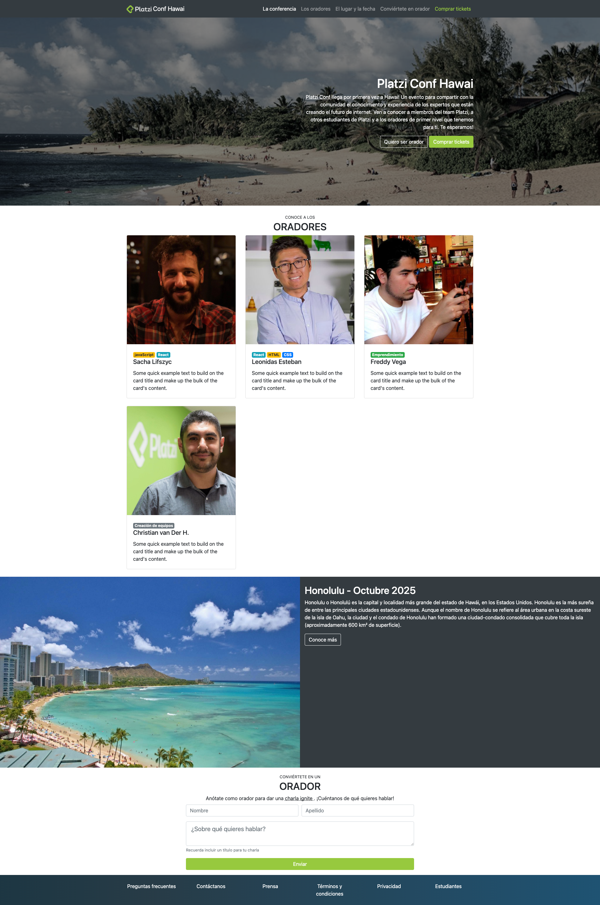

<h1 align="center">PlatziConf Hawai</h1>

  
  

  

Platzi Bootstrap course project, PlatziConf Hawai.

## Development branches

- master: Final result
- grid: Learning Bootstrap grid
- challenges: Grid challenges

Desktop view

Mobile view

## Author

Edwin García  
spark.com.co@gmail.com

## License
[MIT](./LICENSE)
